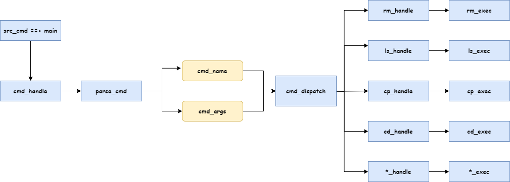

# TinyBox

A tiny shell to run commands on remote machines.

You can study this project to learn how to create a simple shell in Linux/Unix C.

## Usage

``` bash
# REMOTE:
$ tinyboxd -P 0.0.0.0:8000
# LOCAL:
$ tinybox REMOTE_IP:8000
$ tinybox$
```
## Supported commands

- `ls`
- `cd`
- `pwd`
- `mkdir`
- `rm`
- `mv`
- `cp`
- `cat`
- `touch`
- `echo`
- `exit`
- `help`
- `quit`
- `exec`
- `wget`
- `ifconfig`
- `ping`
- `whoami`
- `clear`
- `>`
- `>>`
- `|`

## Design Patterns


